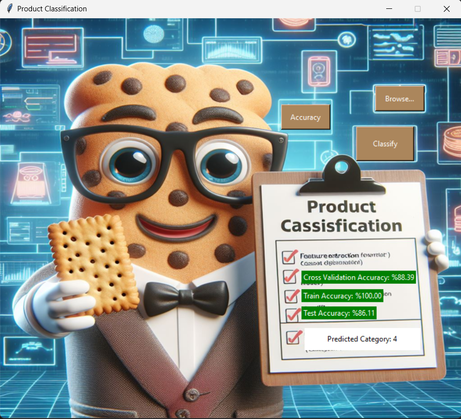

# Product Classification with Computer Vision

This repository contains a Python program for product classification using a classical computer vision model. The purpose of this project is to classify products into specific categories based on images provided.

## Overview

The program follows these main steps:

1. **Data Preparation**: It starts with organizing the data into folders where each category has training and validation subfolders containing images of specific products.
2. **Feature Extraction**: Utilizes Histogram of Oriented Gradients (HoG) for feature extraction from images in the training folders of each category.
3. **Model Training**: Applies Support Vector Machine (SVM) machine learning classifier using the extracted features for training.
4. **Model Evaluation**: Tests the trained model using images from the validation folders of each category and computes validation accuracy.

## Issues Addressed

### Overfitting
The initial model suffered from overfitting, evident from the 100% training accuracy and lower validation accuracy (86%). To mitigate this issue, the following steps were taken:

1. **Data Augmentation**: Techniques like data augmentation were applied to increase the diversity of training data, thereby reducing overfitting.
2. **Cross Validation**: Employed cross-validation techniques to ensure the model's generalizability and robustness.
3. **Parameter Tuning**: Explored various SVM parameters to optimize the model's performance.

## Results

After implementing the aforementioned strategies, the validation accuracy increased to 89%, indicating improved performance in classifying products. However, issues with training accuracy still persist and require further investigation and refinement.

## Repository Structure

- `Product Classification /`: Contains the dataset organized into categories with training and validation images.
- `main.py/`: Source code for the product classification program .
- `controlledAugmentation.py`: Script for augmenting dataset using specified values for each augmentation property.
- `randomAugmentation.py`: Script for augmenting dataset randomly -hopefully it results a good accuracy-.
- `program.png`: image for the program after running it.
- `README.md`: Overview and instructions for the repository.

## Usage

1. Ensure Python and required libraries are installed.
2. Organize your dataset into categories with training and validation subfolders.
3. Run the scripts in the `main.py/`.
   

## Requirements

- Python (version >= 3.0)
- OpenCV
- scikit-learn
- NumPy
- tkinter

## Contributors

- Mohamed Amir
- Ahmed Abdelaziz

## License

This project is licensed under the [MIT License](LICENSE).
